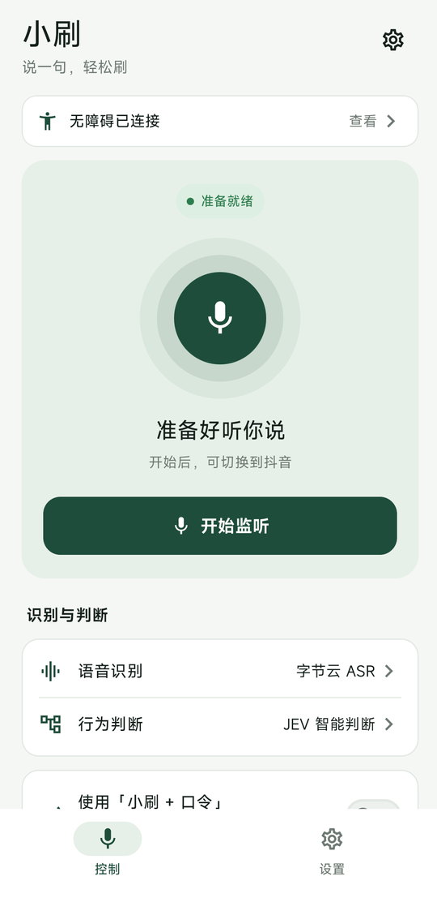
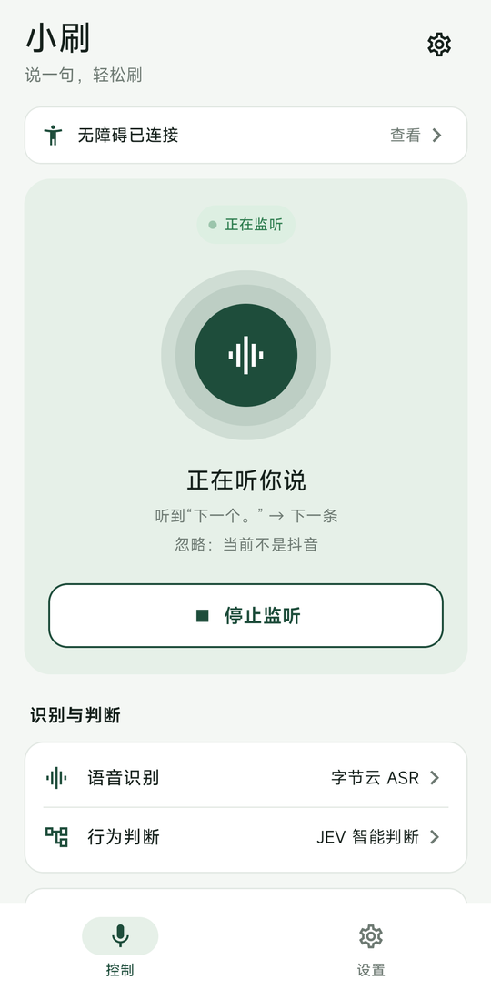
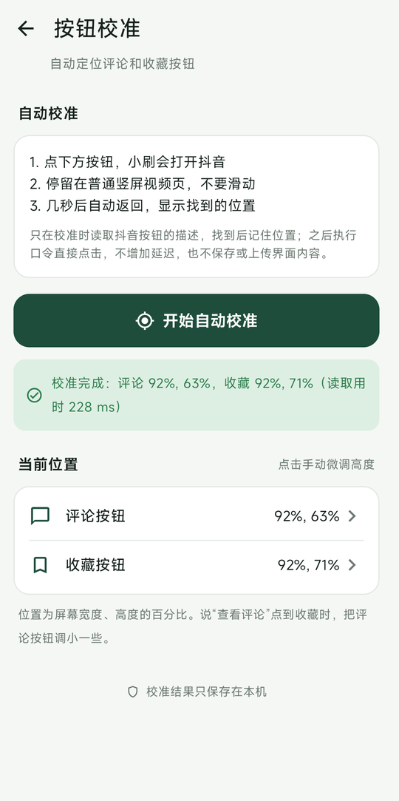
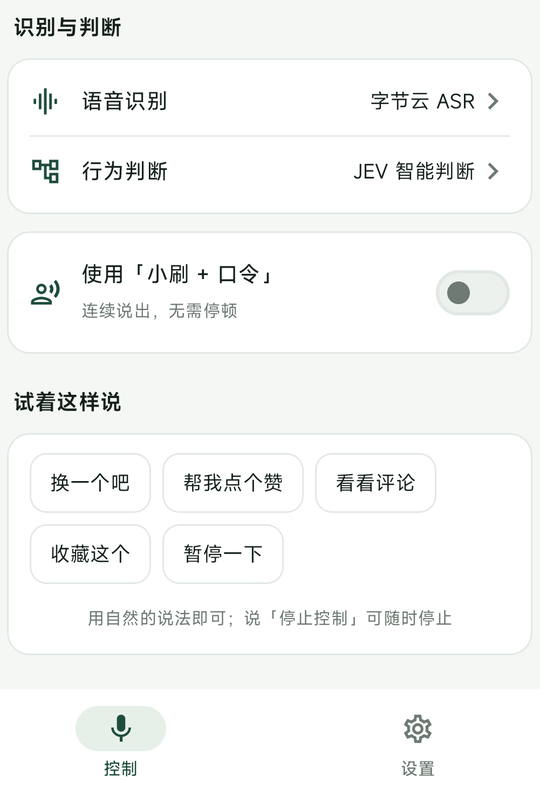

<p align="center">
  
</p>

<h1 align="center">小刷 · 说一句，轻松刷</h1>

<p align="center">
  用嘴刷抖音的 Android 语音遥控器。<br>
  吃饭、躺着、手上有油的时候，说一声“下一条”就翻页。默认完全离线。
</p>

<p align="center">
  <a href="https://github.com/hyh1627723044-oss/xiaoshua/releases/latest"></a>
  
  <a href="LICENSE"></a>
  <a href="https://github.com/hyh1627723044-oss/xiaoshua/actions"></a>
</p>

<p align="center">
  
  
  
  
</p>

## 特性

- **离线识别**：默认用 [sherpa-onnx](https://github.com/k2-fsa/sherpa-onnx) 在手机本地识别固定口令，不联网、不需要账号，模型随 APK 打包。
- **手势直达**：识别到口令后，通过无障碍手势直接操作抖音，不截图、不读取视频内容。
- **9 个口令**：下一条、上一条、播放、暂停、点赞点赞、查看评论、关闭评论、收藏一下、停止控制。
- **可选：自然语言**：可以改用火山引擎云端识别，再交给 [JEV](https://openrouter.ai/typesafe/jev-1.13) 判断意图，说“换一个吧”“帮我点个赞”也能听懂。
- **防误触**：
  - 否定句（如“不要点赞”）不会触发。
  - 拿不准时一律不执行。
  - 过期的识别结果直接丢弃。
  - 可选的“小刷 + 口令”唤醒前缀。
- **停止永远可用**：云端模式下也同时运行本地的“停止控制”识别，断网照样能用语音停下来。
- **按钮自动校准**：只在校准时读取一次评论和收藏按钮的位置，实测一次读取约 228 ms。之后直接点击，不给每次操作增加延迟。

## 下载安装

到 [Releases](https://github.com/hyh1627723044-oss/xiaoshua/releases/latest) 下载最新的 APK，需要 Android 8.0 及以上。

> 当前 APK 使用调试签名，仅供体验。部分手机安装侧载应用后，需要先在“应用详情 → 允许受限制的设置”里放行，才能开启无障碍服务。

## 快速上手

1. 打开小刷，点顶部的“无障碍服务未开启”，在系统设置里启用“小刷手势控制”。
2. 回到小刷，点“开始监听”，授予麦克风和通知权限。
3. 切到抖音，停在普通竖屏视频页。
4. 说“下一条”。
5. 想停的时候说“停止控制”，或点通知栏里的“停止”。锁屏也会自动停止。

第一次使用建议到“设置 → 按钮校准”点一次自动校准，让“查看评论”和“收藏一下”点得更准。

## 怎么说

小刷有两种说话方式，在“设置”里切换。

### 固定口令（默认）

需要完整说出口令，可以连着说，不用停顿：

| 口令 | 动作 |
| --- | --- |
| 下一条 / 上一条 | 上下滑动切换视频 |
| 播放 / 暂停 | 点一下屏幕中央 |
| 点赞点赞 | 双击屏幕中央 |
| 查看评论 / 关闭评论 | 点击评论按钮 / 系统返回 |
| 收藏一下 | 点击收藏按钮，再说一次会取消收藏 |
| 停止控制 | 停止监听，任何模式下都可用 |

打开“小刷 + 口令”后，需要说成“小刷下一条”这样，能明显减少视频外放导致的误触。

改用云端识别后，“严格口令”还额外支持“下一个”“点个赞”“收藏”这类常见说法，但仍然是整句匹配。

### 自然语言（JEV）

云端识别加上 JEV 智能判断以后，可以用自然的说法，比如“换一个吧”“帮我点个赞”“看看评论”。JEV 只能从固定的几个动作里选一个，没把握时会选“不执行”。点赞和收藏要求更高的置信度。

## 可选：云端识别

云端模式需要你自己的服务账号。小刷不经过任何中间服务器，请求直接发到你填写的地址。

**1. 语音识别：火山引擎**
- 在火山引擎控制台开通“豆包录音文件识别”，然后创建一个 API Key。
- 在小刷的“设置 → 字节 ASR”里填入 API Key。
- Resource ID 默认为 `volc.seedasr.auc`（模型 2.0）。如果你开通的是 1.0 极速版，改成 `volc.bigasr.auc_turbo`。
- 点“试录测试”录 3 秒，确认能正常返回识别结果。

**2. 意图判断：JEV（可选）**

在“设置 → JEV”中填写下表中任一组配置。两种接法的请求格式相同。

| 接入方式 | 服务 URL | 模型 |
| --- | --- | --- |
| OpenRouter | `https://openrouter.ai/api/alpha/decisions` | `typesafe/jev-1.13` |
| JEV 官方 | `https://jevtypesafeai.com/api/v1/decide` | `jev-1.13.0` |

## 隐私

- **本地关键词模式**：不发起任何网络请求。
- **云端模式**：
  - 只上传本地 VAD 判定为“一句话”的短音频，每句最长 8 秒，静音时不上传。
  - JEV 只收到转写后的文字。
  - 音频和文字都不写入文件或日志。
- **执行动作时**：只读取前台应用的包名，确认是抖音才执行，不遍历界面、不截图。
- **按钮校准**：只在你点“自动校准”时读取一次按钮描述。
- **密钥**：用 Android Keystore 加密后保存在本机，并禁用了应用备份。

## 已知限制

- **本地识别**：本地口令识别的是固定的声音模式，不理解语义，视频外放中的“暂停”也可能触发。建议戴耳机，或开启“小刷 + 口令”。
- **云端识别**：云端 VAD 无法区分你的声音和视频里的人声。
- **只按位置操作**：
  - 小刷不读取页面状态。播放和暂停都是点一下屏幕，“关闭评论”执行的是系统返回。
  - 不处理弹窗、直播、横屏等特殊页面。
- **按钮校准**：自动校准依赖抖音为按钮提供的无障碍描述。如果找不到按钮，可以手动微调位置。
- **未经实测**：耗电、后台保活和端到端延迟会因手机型号而不同，目前只在少量设备上试用过。

## 工作原理

```text
麦克风 16 kHz ─┬─ 本地模式：sherpa-onnx 关键词识别 ──────────────┐
               └─ 云端模式：Silero VAD 切句 → 火山 ASR 转写       │
                            ├─ 严格口令：整句匹配                  │
                            └─ JEV：从固定动作中选一个             │
                                           ↓                      ↓
                          过期 / 去重 / 前台检查 → 无障碍手势 → 抖音
```

- **技术栈**：Kotlin、Jetpack Compose、sherpa-onnx 1.13.8（关键词识别和 Silero VAD）、OkHttp。
- **代码结构**：
  - 识别、网络和手势逻辑在 `app/src/main/java/.../shortvideokws/`。
  - 界面在 `ui/` 子包。

## 从源码构建

需要 JDK 17、Android SDK 35（Build Tools 35.0.0）、Python 3 和 curl。

```sh
python scripts/prepare_assets.py      # 下载并校验 sherpa-onnx AAR 和关键词模型
./gradlew :app:testDebugUnitTest :app:lintDebug :app:assembleDebug
```

- 脚本会校验 `assets.lock.json` 中的 SHA-256，并检查每个口令的音素都在模型词表里。
- 大文件不提交到 Git。约 629 KB 的 Silero VAD 模型直接提交在仓库里。
- 构建产物在 `app/build/outputs/apk/debug/`。

**测试**：
- 单元测试覆盖了：请求过期与去重、整句口令匹配、VAD 分段状态机、WAV 封装、火山 ASR 和 JEV 的协议（使用 MockWebServer）、凭证加密。
- 每次推送都会由 GitHub Actions 运行测试、lint 和构建。
- 真机验收清单见 [docs/verification-log.md](docs/verification-log.md)。

## 致谢

- [sherpa-onnx](https://github.com/k2-fsa/sherpa-onnx)：离线关键词识别和 VAD 推理。
- [Silero VAD](https://github.com/snakers4/silero-vad)：语音活动检测模型。
- [ShortVideoAssistant](https://github.com/bunny-chz/ShortVideoAssistant)：交互方式的灵感来源。小刷的代码是独立编写的。

第三方组件的许可证见 [THIRD_PARTY.md](THIRD_PARTY.md)。

## 许可证

[MIT](LICENSE)
